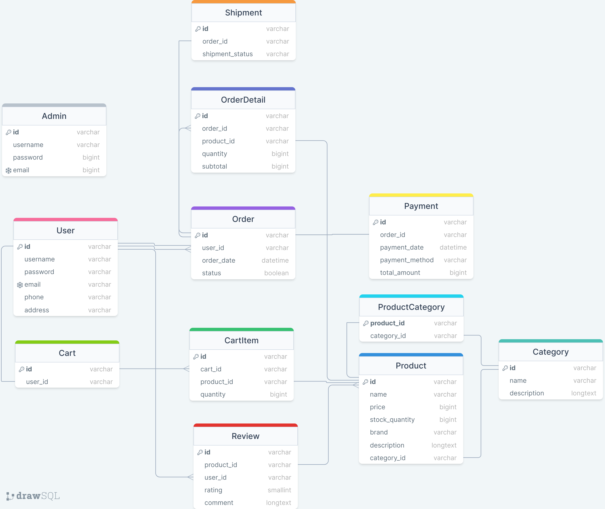

# wuw: Whatever You Want
"당신이 원하는 것은 무엇이든"를 슬로건으로 하는 초간단 쇼핑몰이다.  
원하는 모든 것이 있지만, 접근은 간편한!

## 요구사항 정의
### 사용자 관리

- 사용자는 회원가입 및 로그인을 할 수 있어야 한다.
- 회원은 개인정보를 수정하고 주문 내역을 확인할 수 있어야 한다.

### 제품 관리

- 관리자는 제품을 추가, 수정, 삭제할 수 있어야 한다.
- 각 제품은 이름, 가격, 재고량, 설명 등의 정보를 가지고 있어야 한다.

### 카테고리 및 필터링

- 제품은 카테고리에 속해야 하고, 사용자는 카테고리를 기반으로 제품을 검색할 수 있어야 한다.
- 가격대나 브랜드 등의 필터를 사용하여 제품을 좀 더 세부적으로 찾을 수 있어야 한다.

### 장바구니 및 주문

- 사용자는 제품을 장바구니에 담고 주문할 수 있어야 한다.
- 주문 후에는 주문 상태를 확인할 수 있어야 하고, 주문 내역을 확인할 수 있어야 한다.

### 결제 시스템

- 사용자는 신용카드, 또는 기타 결제 수단을 사용하여 주문을 결제할 수 있어야 한다.
- 결제 시스템은 보안을 유지해야 하고, 주문이 성공적으로 이루어졌을 때 사용자에게 이메일 등의 알림이 전송되어야 한다.

### 배송 및 추적

- 주문이 완료되면 배송 상태를 확인할 수 있어야 한다.
- 배송 추적 기능을 통해 사용자는 주문의 현재 상태를 실시간으로 확인할 수 있어야 한다.

### 리뷰 및 평가

- 사용자는 제품에 대한 리뷰를 작성하고 별점을 부여할 수 있어야 한다.
- 다른 사용자는 리뷰를 확인하여 제품을 선택할 때 참고할 수 있어야 한다.

## 데이터베이스 설계

